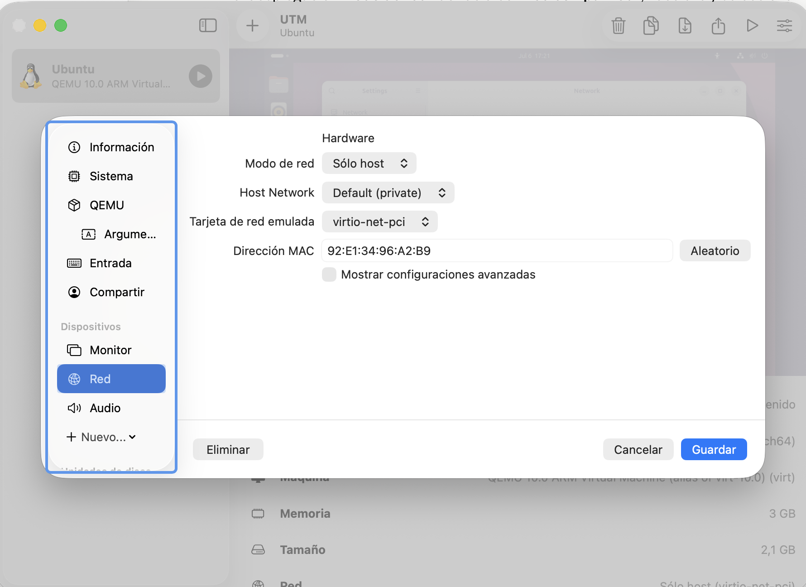
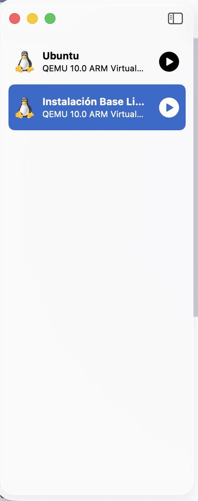

# Laboratorio de Ciberseguridad — Entorno Aislado (VM)

## Herramienta utilizada
Para este ejercicio se utilizó **UTM** en lugar de VirtualBox, ya que el
equipo anfitrión es una MacBook Pro M2 (arquitectura ARM), donde VirtualBox
no ofrece soporte estable. UTM cumple el mismo propósito de virtualización y
aislamiento. Los modos de red de UTM tienen equivalencia directa con los de
VirtualBox.

- **Guest (invitado):** Ubuntu Desktop 26.04 LTS (ARM64)
- **Recursos asignados:** 2 CPU / 3 GB RAM / 26,8 GB disco
- **Backend:** QEMU (necesario para habilitar el modo Sólo host / Host Only)

## 1. Configuración de red

Modo seleccionado: **Sólo host (Host Only)**, equivalente a
"Solo-Anfitrión / Red Interna" de VirtualBox.

## 2. Justificación técnica

Para esta prueba inicial la máquina no necesita salida a internet, por lo que
se descartó el modo NAT/Red Compartida. Se eligió **Sólo host (Host Only)**
porque crea una red virtual privada donde la VM queda aislada tanto de internet
como de la red doméstica: solo puede comunicarse con el anfitrión (y con otras
VMs en el mismo modo), nunca con el resto de dispositivos de mi LAN. Esto
garantiza que, si el sistema invitado se ve comprometido durante una prueba
(malware, exploits, software vulnerable), la amenaza queda contenida dentro del
laboratorio y no puede propagarse.

**Por qué NO se usó el modo Puente (Bridged):** el modo Puente conecta la VM
directamente a la red física, asignándole una IP del router y volviéndola
visible como un dispositivo más de la LAN. Esto rompe el aislamiento del
laboratorio y expone toda mi red doméstica a cualquier actividad maliciosa del
entorno de pruebas: es un error de seguridad clásico en principiantes. El
principio de **aislamiento** exige que un entorno de análisis de malware o
pentesting nunca tenga contacto directo con redes productivas o personales.

## 3. Punto de restauración (Snapshot)

En UTM, el equivalente al gestor de instantáneas de VirtualBox es la función
**Clone**. Se creó un clon del sistema recién instalado, nombrado
**"Instalación Base Limpia"**, que funciona como punto de restauración limpio
al cual volver tras cada prueba, preservando el estado original del sistema.
