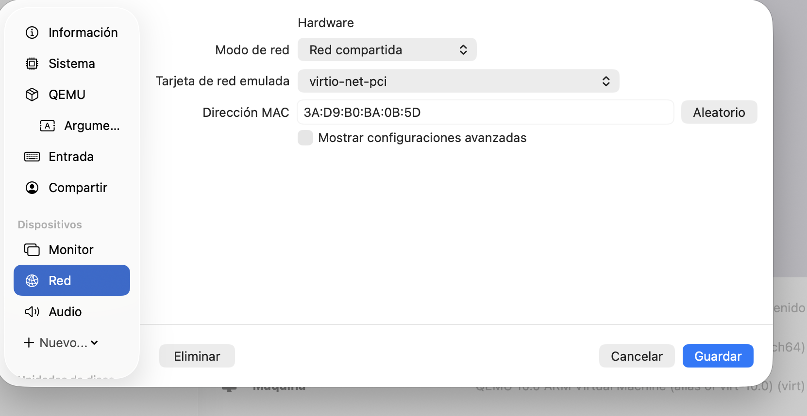
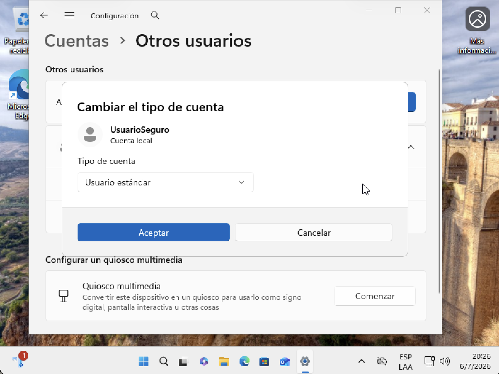
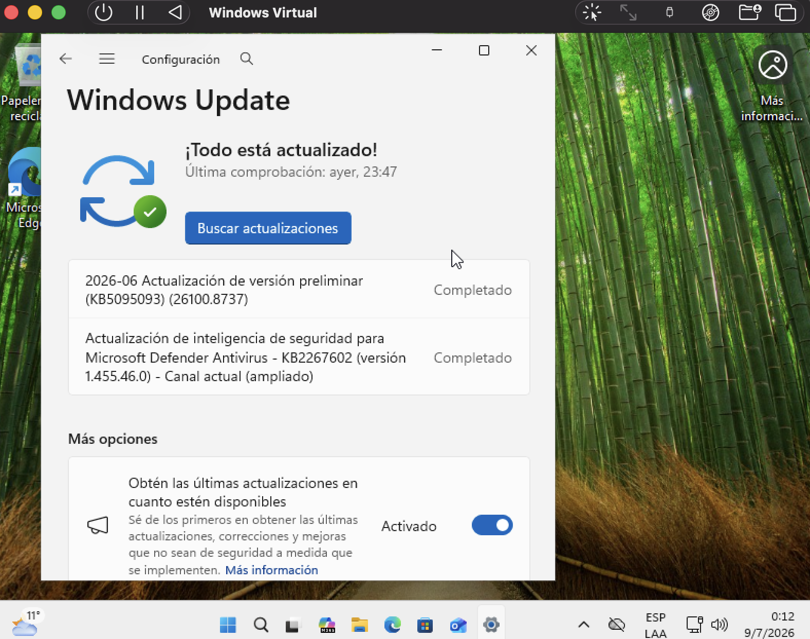
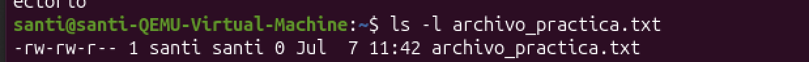
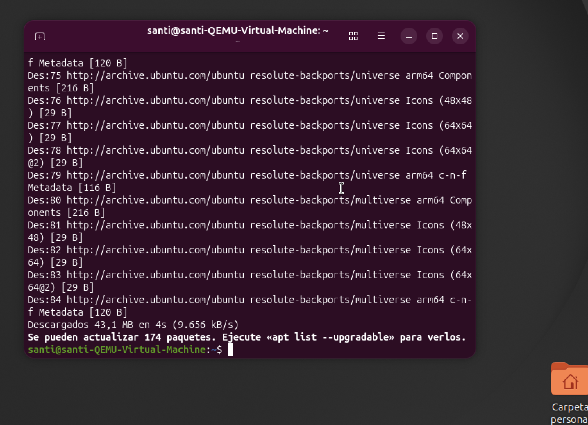

# Reporte Técnico de Configuración de Laboratorio

**Mi primer laboratorio seguro de ciberseguridad — Máquina de Prácticas**

**Estudiante:** Santiago Varela
**Curso:** Ciberseguridad — Coderhouse
**Entorno:** UTM sobre MacBook Pro M2 (ARM). VMs: Windows 11 Pro y Ubuntu 26.04 LTS (ARM64)
**Fecha:** 07/07/2026

> 📄 **Reporte completo en PDF:** [Varela_Santiago_Laboratorio_Ciberseguridad.pdf](./Varela_Santiago_Laboratorio_Ciberseguridad.pdf)

**Nota sobre la herramienta.** El ejercicio se resolvió con **UTM** en lugar de VirtualBox, ya que el equipo anfitrión es una MacBook Pro M2 (arquitectura ARM) donde VirtualBox no tiene soporte estable. Los modos de red de UTM equivalen a los de VirtualBox: **NAT = "Red compartida"**. Cada punto de la consigna se cumple de forma idéntica.

---

## 1. La Fundación: VirtualBox y Red Aislada (NAT)

La máquina virtual se configuró en modo **NAT** (en UTM, "Red compartida") **antes** de encenderla por primera vez. En este modo la VM obtiene salida a internet a través del anfitrión, pero queda detrás de su NAT: no recibe una IP propia en la red física ni es visible como un dispositivo más de la LAN.

*Figura 1. Modo de red "Red compartida" (equivalente a NAT) en la configuración de la VM.*

> **¿Por qué NAT y no otros modos?** Este laboratorio necesita **internet** para descargar los parches de seguridad (aplicar actualizaciones es, en sí mismo, una tarea de hardening). NAT lo permite sin exponer la VM: protege al Host y a la red doméstica porque la máquina no es alcanzable desde otros equipos. Se descartó el modo **Puente (Bridge)**, que colocaría la VM directamente en la red local como un equipo visible y vulnerable. Para fases futuras de análisis de malware, donde no se requiere internet, puede cambiarse temporalmente a Red Interna / Sólo host para lograr aislamiento total.

---

## 2. Capa Windows: Usuarios y Actualizaciones

### 2.1 — Usuario estándar (Principio de Menor Privilegio)

Se creó la cuenta local **UsuarioSeguro** como **Usuario estándar**, separada de la cuenta de administrador (**Santi**). Es el usuario para el trabajo diario. Si un malware se ejecuta bajo esta cuenta, no hereda permisos de administrador y no puede comprometer todo el sistema. La primera imagen confirma el tipo de cuenta; la segunda muestra ambas cuentas conviviendo por separado en el sistema.

*Figura 2a. "UsuarioSeguro" configurado como Usuario estándar (no administrador).*

*Figura 2b. UsuarioSeguro (estándar) y Santi (administrador) como cuentas separadas del sistema.*

### 2.2 — Windows Update

Se ejecutó **Windows Update** y se instalaron los parches disponibles hasta dejar el sistema al día: la pantalla muestra **"¡Todo está actualizado!"** y las actualizaciones (versión preliminar e inteligencia de seguridad de Microsoft Defender) en estado **Completado**. Mantener el sistema parcheado cierra las vulnerabilidades conocidas, que suelen explotarse a las pocas horas de hacerse públicas.

*Figura 3. Windows Update: sistema al día ("¡Todo está actualizado!").*

---

## 3. Capa Linux: Permisos y Gestión de Paquetes

### 3.1 — Permisos de archivo (ls -l)

Se creó un archivo con **touch** y se listaron sus permisos con **ls -l**. La salida **-rw-rw-r--** indica los permisos rwx (lectura/escritura/ejecución) para el usuario, el grupo y el resto. Comprender y limitar estos permisos es la base de la seguridad en Linux, evitando prácticas peligrosas como el **chmod 777**.

*Figura 4. Permisos del archivo mostrados con ls -l.*

### 3.2 — Gestión de paquetes (sudo apt update)

El comando **sudo apt update** actualiza la lista de paquetes desde los repositorios oficiales y firmados de Ubuntu (detectó 174 paquetes actualizables). Instalar software únicamente desde fuentes oficiales —y no desde scripts o PPAs desconocidos— es clave para no comprometer el sistema. El uso de **sudo** aplica el menor privilegio también en Linux: se opera como usuario normal y se elevan permisos solo cuando es necesario.

*Figura 5. sudo apt update sincronizando los repositorios oficiales de Ubuntu.*

---

## 4. La Red de Seguridad: Snapshot Inicial

Con el sistema ya endurecido se creó un punto de restauración llamado **"Hardening Inicial"**. En UTM, el equivalente al gestor de instantáneas de VirtualBox es la función **Clone**: preserva el estado limpio y endurecido de la máquina para poder volver a él si algo sale mal en pruebas futuras. Es la "máquina del tiempo" del laboratorio.

> *Aclaración: la consigna nombra este punto de dos formas —"Clean Install - Hardening applied" en el enunciado y "Hardening Inicial" en el listado de entregables—. Usé "Hardening Inicial" por ser el nombre indicado en el paso 6 del entregable.*

*Figura 6. Instantánea "Hardening Inicial" en la lista de máquinas de UTM.*

---

## Verificación de la consigna

| Punto requerido | Dónde está documentado |
| --- | --- |
| **1** — Red aislada (NAT) + justificación | Figura 1 y su explicación |
| **2** — Usuario estándar separado del admin + Windows Update | Figuras 2a, 2b y 3 |
| **3** — Linux: permisos (`ls -l`) y `sudo apt update` | Figuras 4 y 5 |
| **4** — Snapshot "Hardening Inicial" | Figura 6 |

---

## Conclusión

Se construyó un laboratorio de prácticas con red controlada (NAT) y hardening básico aplicado en dos sistemas: menor privilegio y actualizaciones en Windows, gestión de permisos y paquetes en Linux, y un snapshot como red de seguridad. El hardening es una mentalidad de mejora continua: ante cada cambio, la pregunta guía es siempre la misma — ¿realmente lo necesito, y con qué mínimo de permisos y exposición?
